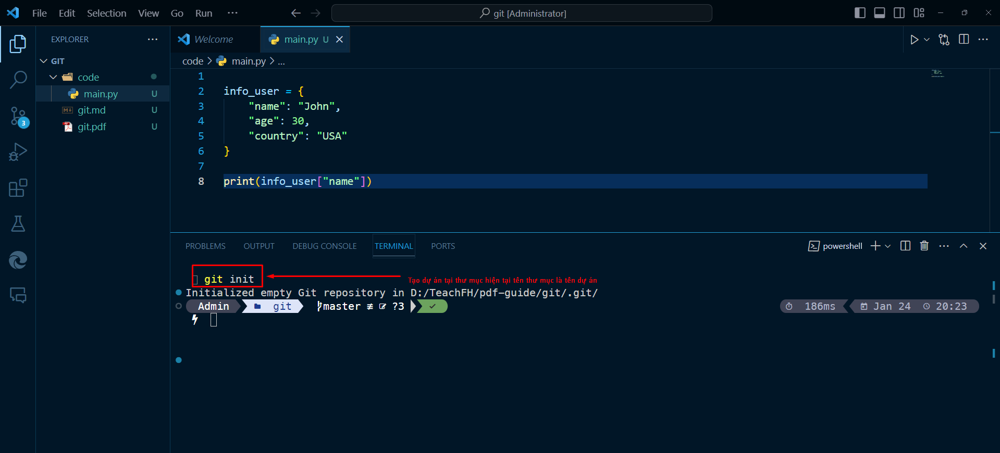
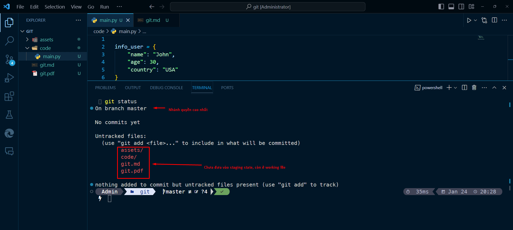
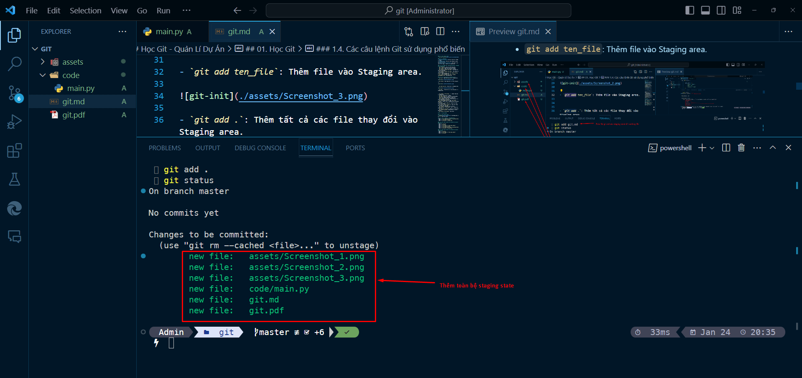
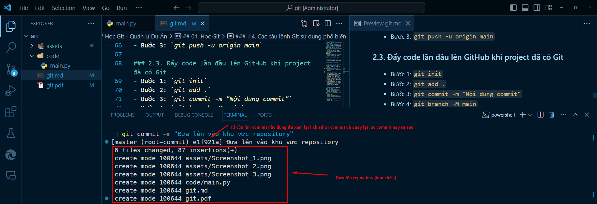
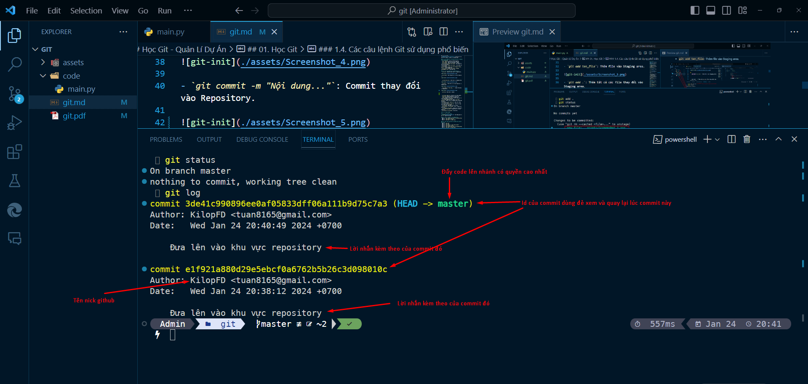
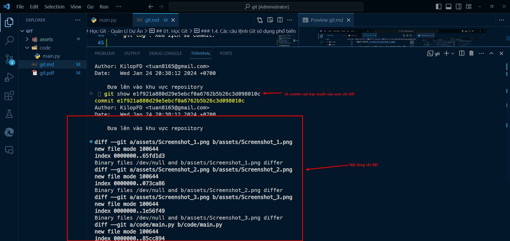
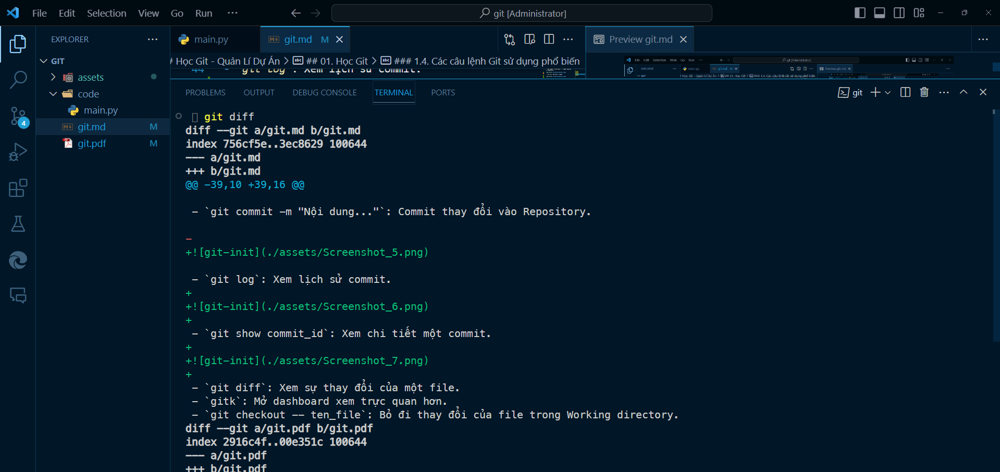
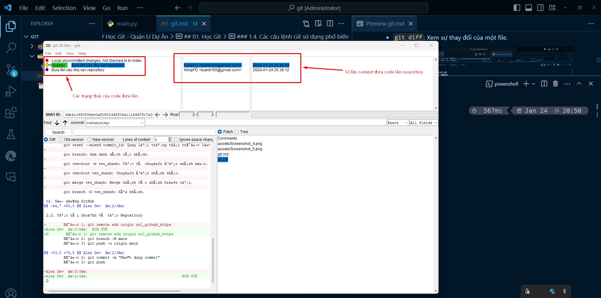

# Học Git - Quản Lí Dự Án

## 01. Học Git

### 1.1. Giới thiệu chung
- [Tải Git tại đây](https://git-scm.com/downloads)

### 1.2. Cài đặt Git
- **Working directory:** Khu vực chứa dự án đang làm việc.
- **Staging area:** Khu vực chứa thông tin thay đổi của các file.
- **Repository (Git directory):** Kho lưu trữ để lưu trữ dữ liệu và lịch sử các phiên bản.

### 1.3. Các thuật ngữ: Working directory, Staging area, Repository
- `git --version`: Kiểm tra phiên bản Git.
- `git --help`: Danh sách các câu lệnh Git.
- `git config`: Cấu hình username và email.
- `git config --global user.name`: Xem thông tin cấu hình username.
- `git config --global user.email`: Xem thông tin cấu hình email.
- `git config --global user.name "Nguyễn Phương Anh Tú"`: Đặt username mới.
- `git config --global user.email "techdev.td1111@gmail.com"`: Đặt email mới.

### 1.4. Các câu lệnh Git sử dụng phổ biến
- `git init`: Khởi tạo kho lưu trữ (repository).

- `git status`: Xem trạng thái của file trong dự án.

- `git add ten_file`: Thêm file vào Staging area.

- `git add .`: Thêm tất cả các file thay đổi vào Staging area.

- `git commit -m "Nội dung..."`: Commit thay đổi vào Repository.

- `git log`: Xem lịch sử commit.

- `git show commit_id`: Xem chi tiết một commit.

- `git diff`: Xem sự thay đổi của một file.

- `gitk`: Mở dashboard xem trực quan hơn.

- `git checkout -- ten_file`: Bỏ đi thay đổi của file trong Working directory.
- `git reset HEAD ten_file` hoặc `git reset ten_file`: Chuyển file từ Staging area về Working directory.
- `git reset --soft commit_id`: Quay lại trạng thái trước commit.
- `git reset --mixed commit_id`: Quay lại trạng thái trước lệnh `git add`.
- `git branch`: Xem danh sách các nhánh.
- `git checkout -b ten_nhanh`: Tạo và chuyển đến nhánh mới.
- `git checkout ten_nhanh`: Chuyển đến nhánh khác.
- `git merge ten_nhanh`: Merge nhánh vào nhánh hiện tại.
- `git branch -D ten_nhanh`: Xóa nhánh.

## 02. Sử dụng GitHub

### 2.1. Giới thiệu chung
- [GitHub](https://github.com/): Hệ thống quản lý dự án và phiên bản code.

### 2.2. Tạo tài khoản và tạo Repository
- Bước 1: `git remote add origin url_github_https`
- Bước 2: `git branch -M main`
- Bước 3: `git push -u origin main`

### 2.3. Đẩy code lần đầu lên GitHub khi project đã có Git
- Bước 1: `git init`
- Bước 2: `git add .`
- Bước 3: `git commit -m "Nội dung commit"`
- Bước 4: `git branch -M main`
- Bước 5: `git remote add origin url_github_https`
- Bước 6: `git push -u origin main`

### 2.4. Đẩy code lần đầu lên GitHub khi project chưa có Git
- Bước 1: `git add .`
- Bước 2: `git commit -m "Nội dung commit"`
- Bước 3: `git push`

